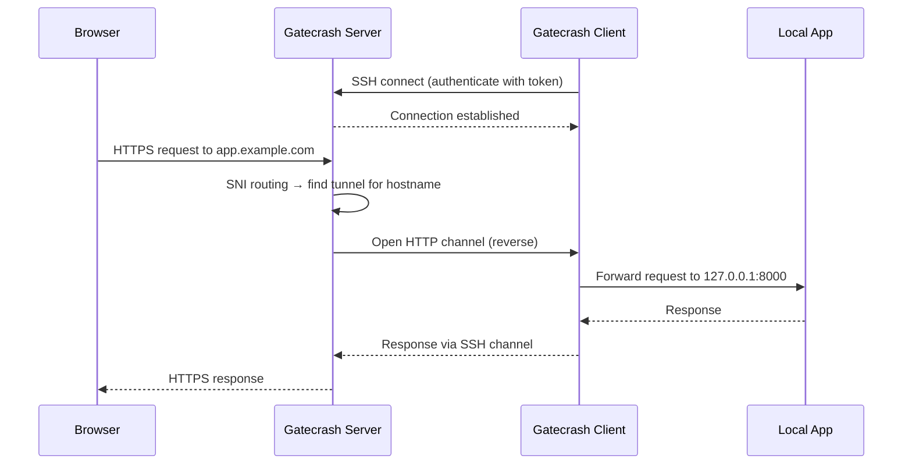
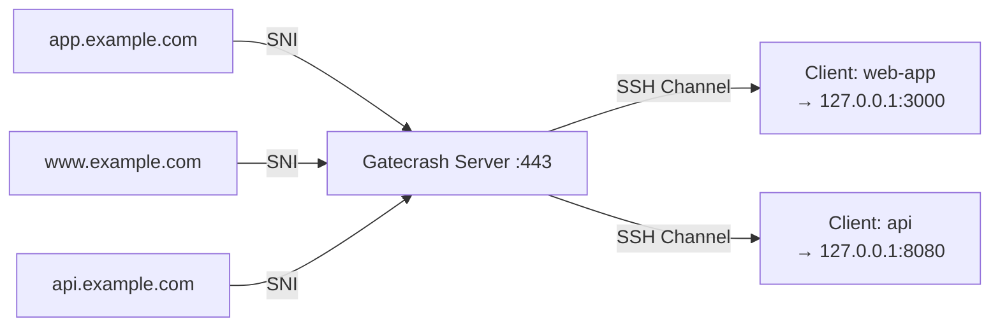
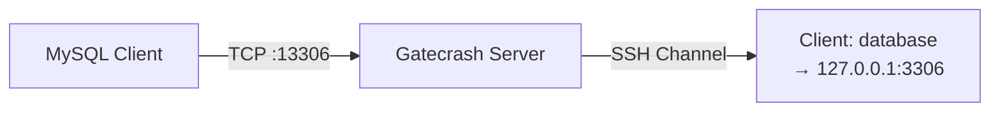

<p align="center">
  
</p>

<h1 align="center">Gatecrash</h1>

<p align="center">
  Self-hosted tunnel server. Expose local services through a public server with automatic TLS.
  <br>
  A self-hosted alternative to Cloudflare Tunnels, ngrok, and similar services.
</p>

<p align="center">
  <a href="#quick-start">Quick Start</a> &bull;
  <a href="#how-it-works">How It Works</a> &bull;
  <a href="#configuration">Configuration</a> &bull;
  <a href="#docker">Docker</a>
</p>

> [!NOTE]
> This project is **vibe coded** with [Claude Code](https://claude.ai/claude-code). The entire codebase — server, client, admin panel, CI/CD, and this README — was built collaboratively with AI. Use at your own risk, but it actually works pretty well.

---

## Quick Start

1. **Provision a server** with a public IP (any Linux VPS will do)

2. **Point a hostname** at your server's IP via DNS (e.g. `admin.example.com`)

3. **Run the installer** — it downloads the binary, generates a config, creates a systemd service, and starts Gatecrash. It will ask for your admin hostname during setup.

   ```bash
   curl -fsSL https://raw.githubusercontent.com/jclement/gatecrash/main/deploy/install.sh | sh
   ```

   Or download from [GitHub Releases](https://github.com/jclement/gatecrash/releases) for manual installation.

4. **Open the admin panel** at `https://admin.example.com`, register your passkey, and click **Add Tunnel** to create your first tunnel

5. **Connect a client** using the command shown in the admin panel:

   ```bash
   gatecrash client \
     --server tunnel.example.com:2222 \
     --token "web-app:YOUR_SECRET" \
     --target 127.0.0.1:8000
   ```

That's it. Requests to your configured hostname now reach your local service on port 8000.

---

## How It Works

Gatecrash uses SSH as the transport layer for tunnel connections. The server accepts SSH connections from clients, then reverse-opens channels back to the client for each incoming HTTP request or TCP connection.



### HTTP Tunnels

HTTP tunnels route traffic based on the `Host` header. Multiple hostnames can map to a single tunnel. TLS certificates are automatically provisioned via Let's Encrypt.



### TCP Tunnels

TCP tunnels forward raw TCP connections on a dedicated port. Useful for databases, game servers, or any non-HTTP protocol.



### Config Live Reload

The server watches `gatecrash.toml` for changes. Valid changes are applied immediately without dropping existing connections. Invalid changes are rejected and the error is shown in the admin panel.

### HTTP Redirects

Redirect hostnames without needing a tunnel:

```toml
[[redirect]]
from = "www.example.com"
to = "example.com"
preserve_path = true

[[redirect]]
from = "old.example.com"
to = "new.example.com/legacy"
preserve_path = false
```

---

## Configuration

### Server Configuration

| Field | Default | Description |
|-------|---------|-------------|
| `server.secret` | auto-generated | Session signing secret (do not share) |
| `server.ssh_port` | random high port | SSH listen port for tunnel connections |
| `server.https_port` | `443` | HTTPS listen port |
| `server.http_port` | `80` | HTTP→HTTPS redirect port (0 to disable) |
| `server.bind_addr` | `0.0.0.0` | Bind address |
| `server.admin_host` | _(disabled)_ | Hostname for admin panel (required to enable it) |
| `tls.acme_email` | | Email for Let's Encrypt |
| `tls.cert_dir` | `./certs` | Certificate storage directory |
| `tls.staging` | `false` | Use Let's Encrypt staging CA |
| `update.enabled` | `true` | Check for updates on startup |
| `update.check_interval` | `6h` | How often to check for updates |
| `update.github_repo` | `jclement/gatecrash` | GitHub repo for update checks |

### Forwarding Headers

For HTTP tunnels, the following headers are injected:

| Header | Value |
|--------|-------|
| `X-Forwarded-For` | Original client IP |
| `X-Forwarded-Proto` | `https` or `http` |
| `X-Forwarded-Host` | Original Host header |
| `X-Real-IP` | Original client IP |
| `X-Request-Id` | Unique request ID |

---

## CLI Reference

```
gatecrash server      [flags]   Start the tunnel server
gatecrash client      [flags]   Connect a tunnel client
gatecrash make-config [flags]   Generate a config file
gatecrash update      [flags]   Self-update to latest release
gatecrash version               Print version
gatecrash help                  Show help
```

### Server Flags

| Flag | Env Var | Default | Description |
|------|---------|---------|-------------|
| `--config` | `GATECRASH_CONFIG` | `/etc/gatecrash/gatecrash.toml` | Config file path |
| `--debug` | | `false` (auto in dev) | Enable debug logging |

### Client Flags

| Flag | Env Var | Description |
|------|---------|-------------|
| `--server` | `GATECRASH_SERVER` | Server SSH address (`host:port`) |
| `--token` | `GATECRASH_TOKEN` | Tunnel token (`tunnel_id:secret`) |
| `--target` | `GATECRASH_TARGET` | Target service address (`[scheme://]host:port`) |
| `--host-key` | `GATECRASH_HOST_KEY` | Server SSH fingerprint (`SHA256:...`) |
| `--tunnel` | | Tunnel spec (repeatable, see below) |
| `--debug` | | Enable debug logging |

#### Multiple Tunnels

To maintain multiple SSH tunnel connections from a single client process, use the `--tunnel` flag once per tunnel:

```bash
gatecrash client \
  --tunnel "server=tunnel.example.com:2222,token=web-app:SECRET,target=localhost:8080" \
  --tunnel "server=tunnel.example.com:2222,token=api:SECRET,target=https://localhost:3000" \
  --tunnel "server=tunnel.example.com:2222,token=db:SECRET,target=localhost:5432,host-key=SHA256:..."
```

Each `--tunnel` value is a comma-separated list of `key=value` pairs:

| Key | Required | Description |
|-----|----------|-------------|
| `server` | yes | Server SSH address (`host:port`) |
| `token` | yes | Tunnel token (`tunnel_id:secret`) |
| `target` | yes | Target service address (`[scheme://]host:port`) |
| `host-key` | no | Server SSH fingerprint (`SHA256:...`) |

Each tunnel maintains its own independent SSH connection with automatic reconnection. The process exits only when all tunnels stop or a signal is received.

The legacy `--server` / `--token` / `--target` flags still work for a single tunnel and can be combined with `--tunnel` flags.

#### Target Schemes

The `--target` flag supports optional scheme prefixes:

| Target | Behavior |
|--------|----------|
| `localhost:8080` | Plain HTTP (default) |
| `https://localhost:8443` | TLS with certificate verification |
| `https+insecure://localhost:8443` | TLS without certificate verification (self-signed certs) |

### make-config Flags

| Flag | Default | Description |
|------|---------|-------------|
| `--output` | `/etc/gatecrash/gatecrash.toml` | Output config file path |
| `--admin-host` | | Admin panel hostname |
| `--acme-email` | | ACME/Let's Encrypt email |
| `--force` | `false` | Overwrite existing config file |

---

## Docker

### Server

```bash
docker run -d \
  -p 443:443 -p 80:80 -p 2222:2222 \
  -v gatecrash-config:/etc/gatecrash \
  -v gatecrash-certs:/app/certs \
  ghcr.io/jclement/gatecrash:latest
```

### Client (Sidecar)

```bash
docker run -d \
  -e GATECRASH_SERVER=tunnel.example.com:2222 \
  -e GATECRASH_TOKEN=web-app:YOUR_SECRET \
  -e GATECRASH_TARGET=app:8000 \
  --network=app-network \
  ghcr.io/jclement/gatecrash:latest \
  gatecrash client
```

### Docker Compose Example

```yaml
services:
  app:
    image: your-app:latest
    ports:
      - "8000:8000"

  tunnel:
    image: ghcr.io/jclement/gatecrash:latest
    command: ["gatecrash", "client"]
    environment:
      GATECRASH_SERVER: tunnel.example.com:2222
      GATECRASH_TOKEN: web-app:YOUR_SECRET
      GATECRASH_TARGET: app:8000
    depends_on:
      - app
```

---

## Development

```bash
# Install tools
mise install

# Download frontend assets
mise run setup

# Run server with hot-reload
mise run dev

# Run tests
mise run test

# Build
mise run build

# Test release
mise run release-snapshot
```

---

## Architecture

```
gatecrash/
├── cmd/gatecrash/       # Single binary entry point
├── internal/
│   ├── config/          # TOML config + file watcher
│   ├── server/          # SSH server, HTTP proxy, TCP forward, vhost routing, TLS
│   ├── client/          # SSH client, HTTP/TCP handlers, reconnect logic
│   ├── admin/           # Web admin panel (passkeys, sessions, templates)
│   ├── protocol/        # SSH channel types and control messages
│   ├── token/           # bcrypt-based tunnel authentication
│   └── update/          # Self-update via GitHub releases
├── web/                 # HTML templates + static assets
├── deploy/              # Install script, systemd service
└── .github/             # CI/CD, dependabot
```

## License

MIT
