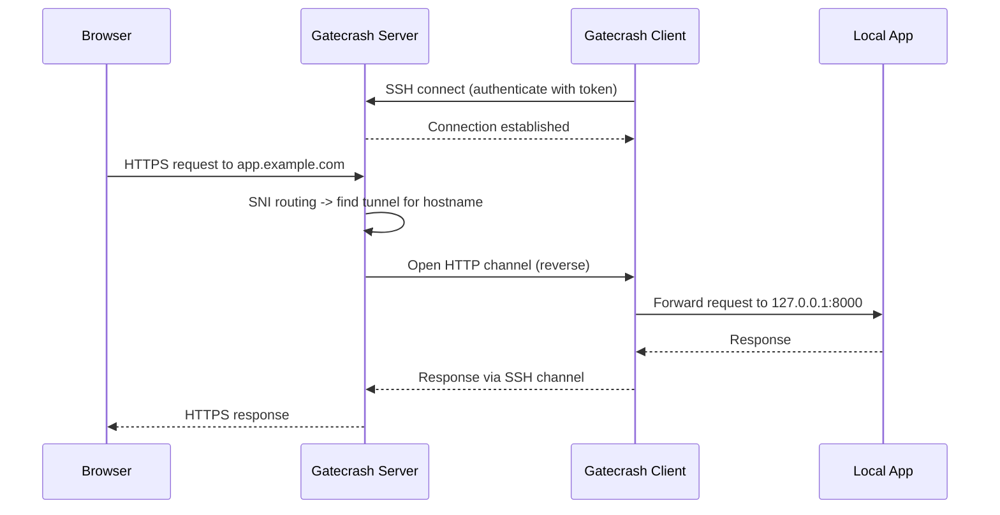

<p align="center">
  
</p>

<h1 align="center">Gatecrash</h1>

<p align="center">
  Self-hosted tunnel server. Expose local services through a public server with automatic TLS.
  <br>
  A self-hosted alternative to Cloudflare Tunnels, ngrok, and similar services.
</p>

<p align="center">
  <a href="#installation">Installation</a> &bull;
  <a href="#quick-start">Quick Start</a> &bull;
  <a href="#how-it-works">How It Works</a> &bull;
  <a href="#configuration">Configuration</a> &bull;
  <a href="#authentication--access-policies">Auth &amp; Policies</a> &bull;
  <a href="#docker">Docker</a>
</p>

> [!NOTE]
> This project is **vibe coded** with [Claude Code](https://claude.ai/claude-code). The entire codebase — server, client, admin panel, CI/CD, and this README — was built collaboratively with AI. Use at your own risk, but it actually works pretty well.

---

## Installation

Gatecrash ships as two separate binaries:

| Binary | Purpose | Size |
|--------|---------|------|
| `gatecrash-server` | Tunnel server with admin panel, TLS, passkey auth | ~15 MB |
| `gatecrash` | Lightweight tunnel client | ~7 MB |

### Linux Server (Quick Install)

Installs `gatecrash-server`, creates a systemd service, and starts it:

```bash
curl -fsSL https://raw.githubusercontent.com/jclement/gatecrash/main/deploy/install.sh | sh
```

### Homebrew (macOS/Linux)

```bash
# Server
brew install jclement/tap/gatecrash-server

# Client
brew install jclement/tap/gatecrash
```

### Go

```bash
# Server
go install github.com/jclement/gatecrash/cmd/gatecrash-server@latest

# Client
go install github.com/jclement/gatecrash/cmd/gatecrash@latest
```

### Docker

```bash
# Server
docker pull ghcr.io/jclement/gatecrash-server:latest

# Client (lightweight)
docker pull ghcr.io/jclement/gatecrash:latest
```

### Binary Releases

Download pre-built binaries for Linux, macOS, and Windows from [GitHub Releases](https://github.com/jclement/gatecrash/releases).

---

## Quick Start

1. **Provision a server** with a public IP (any Linux VPS will do)

2. **Point a hostname** at your server's IP via DNS (e.g. `admin.example.com`)

3. **Run the installer** — it downloads the binary, generates a config, creates a systemd service, and starts Gatecrash. It will ask for your admin hostname during setup.

   ```bash
   curl -fsSL https://raw.githubusercontent.com/jclement/gatecrash/main/deploy/install.sh | sh
   ```

   Or download from [GitHub Releases](https://github.com/jclement/gatecrash/releases) for manual installation.

4. **Open the admin panel** at `https://admin.example.com`, register your passkey, and click **Add Tunnel** to create your first tunnel

5. **Connect a client** using the command shown in the admin panel (the SSH port and host key are displayed when you create a tunnel):

   ```bash
   gatecrash \
     --server tunnel.example.com:51234 \
     --host-key "SHA256:..." \
     --token "web-app:YOUR_SECRET" \
     --target 127.0.0.1:8000
   ```

   > The SSH port is randomly assigned on first run (check `ssh_port` in `gatecrash.toml`). The exact connection command is shown in the admin panel when you create a tunnel or regenerate a secret.

That's it. Requests to your configured hostname now reach your local service on port 8000.

---

## How It Works

Gatecrash uses SSH as the transport layer for tunnel connections. The server accepts SSH connections from clients, then reverse-opens channels back to the client for each incoming HTTP request or TCP connection.


```mermaid
sequenceDiagram
    participant User as Browser
    participant Server as Gatecrash Server
    participant Client as Gatecrash Client
    participant App as Local App

    Client->>Server: SSH connect (authenticate with token)
    Server-->>Client: Connection established

    User->>Server: HTTPS request to app.example.com
    Server->>Server: SNI routing -> find tunnel for hostname
    Server->>Client: Open HTTP channel (reverse)
    Client->>App: Forward request to 127.0.0.1:8000
    App-->>Client: Response
    Client-->>Server: Response via SSH channel
    Server-->>User: HTTPS response
```

### HTTP Tunnels

HTTP tunnels route traffic based on the `Host` header. Multiple hostnames can map to a single tunnel. TLS certificates are automatically provisioned via Let's Encrypt.

### TCP Tunnels

TCP tunnels forward raw TCP connections on a dedicated port. Useful for databases, game servers, or any non-HTTP protocol.

### Config Live Reload

The server watches `gatecrash.toml` for changes. Valid changes are applied immediately without dropping existing connections. Invalid changes are rejected and the error is shown in the admin panel.

### HTTP Redirects

Redirect hostnames without needing a tunnel:

```toml
[[redirect]]
from = "www.example.com"
to = "example.com"
preserve_path = true
```

---

## Configuration

### Server Configuration (`gatecrash.toml`)

The config file is auto-generated on first run with sensible defaults and inline documentation.

#### Server Settings

| Field | Default | Description |
|-------|---------|-------------|
| `server.secret` | auto-generated | Session signing secret (do not share) |
| `server.ssh_port` | random high port | SSH listen port for tunnel connections |
| `server.https_port` | `443` | HTTPS listen port |
| `server.http_port` | `80` | HTTP->HTTPS redirect port (0 to disable) |
| `server.bind_addr` | `0.0.0.0` | Bind address |
| `server.admin_host` | _(disabled)_ | Hostname for admin panel (required to enable it) |

#### TLS Settings

| Field | Default | Description |
|-------|---------|-------------|
| `tls.acme_email` | | Email for Let's Encrypt expiration notices |
| `tls.cert_dir` | `./certs` | Certificate storage directory |
| `tls.staging` | `false` | Use Let's Encrypt staging CA |

#### Update Settings

| Field | Default | Description |
|-------|---------|-------------|
| `update.enabled` | `true` | Check for updates on startup |
| `update.check_interval` | `6h` | How often to check for updates |
| `update.github_repo` | `jclement/gatecrash` | GitHub repo for update checks |

#### Tunnel Options

| Option | Default | Description |
|--------|---------|-------------|
| `preserve_host` | `false` | Pass the original `Host` header to the backend |
| `tls_passthrough` | `false` | Forward raw TLS without terminating (backend handles TLS) |
| `ip_policy` | | ID of an [IP policy](#authentication--access-policies) to restrict by source IP (HTTP and TCP, including passthrough) |
| `auth_policy` | | ID of an [auth policy](#authentication--access-policies) requiring a signed-in user (HTTP only; not with `tls_passthrough`) |

Example:

```toml
[[tunnel]]
id = "backend-api"
type = "http"
hostnames = ["api.example.com"]
secret_hash = "$2a$12$..."
preserve_host = true
ip_policy = "internal"     # see [[ip_policy]]
auth_policy = "staff"      # see [[auth_policy]]
```

#### Forwarding Headers

For HTTP tunnels (when `tls_passthrough = false`), the following headers are injected:

| Header | Value |
|--------|-------|
| `X-Forwarded-For` | Original client IP |
| `X-Forwarded-Proto` | `https` or `http` |
| `X-Forwarded-Host` | Original Host header |
| `X-Real-IP` | Original client IP |
| `X-Request-Id` | Unique request ID |

When an `auth_policy` authenticates a request, the user's ID is injected as `x-Gatecrash-User` (header name configurable) along with `X-Gatecrash-Role`.

---

## Authentication & Access Policies

### Users

Gatecrash authenticates with **passkeys** — phishing-resistant credentials bound to a device. On first boot, open the admin host and provision the first **admin**. Users have an immutable **ID** (also the value injected as the identity header), a **role** (`admin` or `user`), and one or more passkeys:

- **admin** — manages tunnels, access policies, users, and the audit log.
- **user** — signs in and can be granted access to protected tunnels; lands on their own Passkeys page.

On the **Users** page an admin adds a user (ID + role), which produces a one-time **invite link** (`https://<admin_host>/invite/<token>`); opening it registers the user's passkey. **Reset** clears a user's passkeys and issues a fresh invite. Everyone manages their own passkeys from the **Passkeys** page. Users live in `<config_dir>/users.json`.

### Access policies

Policies are reusable and assigned to tunnels by ID. The two are **independent gates** — a tunnel may use either, both (AND), or neither.

**Auth policy** — a set of allowed users (signed in with a passkey), plus an optional static HTTP Basic password for non-interactive clients. HTTP-only; not available with `tls_passthrough`. Visitors are sent to the admin host to sign in and bounced back to the tunnel.

```toml
[[auth_policy]]
id = "staff"
users = ["alice", "bob"]   # allowed user IDs
# header = "x-Gatecrash-User"   # optional: override the identity header name
# username = "ci"               # optional static HTTP Basic credential
# password_hash = "$2a$12$..."  #   (set/rotated from the admin UI)
```

**IP policy** — a source-IP allowlist (with optional comments), reusable across tunnels. Works on HTTP and TCP (including passthrough). Because allowed clients pass through with **no credential**, it suits services that can't authenticate (MCP servers, API/tool endpoints).

```toml
[[ip_policy]]
id = "internal"
[[ip_policy.range]]
cidr = "10.0.0.0/8"
comment = "office LAN"
```

An IP gets allowed three ways: a **permanent** range; **self-service** (a blocked HTTP visitor signs in and grants their IP for 7 days); or a shareable **enrollment link** (`/enroll/<token>`) that lets anyone authorize their own IP for 7 days **without signing in** — the only self-service option for TCP tunnels. Grants are listed and revocable from the policy's **IPs & Link** panel, and are keyed by source IP (everyone behind one public IP shares access; prefer a permanent CIDR for rotating IPv6 prefixes). Treat enrollment links like passwords; **Rotate** invalidates old ones.

> User login and enrollment links require `server.admin_host` to be configured.

---

## Audit Log

All admin panel changes are recorded in an audit log, viewable from the **Audit Log** tab.

Logged events include:
- Tunnel create, edit, delete, and secret regeneration
- Redirect create, edit, delete
- User and access-policy changes (create, edit/reset, delete)
- Sign-ins and IP authorizations

Each entry records the timestamp, the acting user's ID, the action, and a detail. The log is stored at `<config_dir>/audit.json` (NDJSON, rotated) and the admin UI shows the most recent 1,000 entries, filterable by user and action.

---

## CLI Reference

### Server (`gatecrash-server`)

```
gatecrash-server              Start the tunnel server (default)
gatecrash-server make-config  Generate a config file
gatecrash-server update       Self-update to latest release
gatecrash-server version      Print version
gatecrash-server help         Show help
```

| Flag | Env Var | Default | Description |
|------|---------|---------|-------------|
| `--config` | `GATECRASH_CONFIG` | `/etc/gatecrash/gatecrash.toml` | Config file path |
| `--debug` | | `false` | Enable debug logging |

### Client (`gatecrash`)

The client runs directly without subcommands:

```
gatecrash [flags]       Connect a tunnel to the server
gatecrash update        Self-update to latest release
gatecrash version       Print version
gatecrash help          Show help
```

| Flag | Env Var | Required | Default | Description |
|------|---------|----------|---------|-------------|
| `--server` | `GATECRASH_SERVER` | **Yes** | | Server SSH address (`host:port`) |
| `--token` | `GATECRASH_TOKEN` | **Yes** | | Tunnel token (`tunnel_id:secret`) |
| `--target` | `GATECRASH_TARGET` | **Yes** | | Target address (repeatable, see below) |
| `--host-key` | `GATECRASH_HOST_KEY` | **Yes** | | Server SSH fingerprint (`SHA256:...`) |
| `--count` | `GATECRASH_COUNT` | No | `1` | Parallel tunnel connections (1-10) |
| `--debug` | | No | `false` | Enable debug logging |

#### Multi-Target Routing

An HTTP tunnel with multiple hostnames can route each to a different backend using `--target`:

```bash
gatecrash --server host:port --token homelab:secret \
  --target git.example.com=forgejo:3000 \
  --target gist.example.com=opengist:8080
```

A bare `--target host:port` (without `=`) sets the default target for unmatched hostnames and TCP tunnels.

Via environment variable: `GATECRASH_TARGET=git.example.com=forgejo:3000,gist.example.com=opengist:8080`

#### Target Schemes

Route targets support scheme prefixes:

| Target | Behavior |
|--------|----------|
| `localhost:8080` | Plain HTTP / TCP (default) |
| `https://localhost:8443` | TLS with certificate verification |
| `https+insecure://localhost:8443` | TLS without certificate verification |

---

## Docker

### Server

```bash
# Replace 51234 with the ssh_port from your gatecrash.toml
docker run -d \
  -p 443:443 -p 80:80 -p 51234:51234 \
  -v gatecrash-config:/etc/gatecrash \
  ghcr.io/jclement/gatecrash-server:latest
```

The SSH port is randomly generated on first run. Check `ssh_port` in your `gatecrash.toml` to find the assigned port.

### Client

```bash
docker run -d \
  -e GATECRASH_SERVER=tunnel.example.com:51234 \
  -e GATECRASH_HOST_KEY=SHA256:your_host_key_fingerprint \
  -e GATECRASH_TOKEN=web-app:YOUR_SECRET \
  -e GATECRASH_TARGET=app:8000 \
  --network=app-network \
  ghcr.io/jclement/gatecrash:latest
```

The client image is minimal -- just the tunnel client binary with ca-certificates.

### Docker Compose -- Client with Service

A typical deployment pairs the `gatecrash` client with your application:

```yaml
services:
  # Your application
  whoami:
    image: traefik/whoami
    expose:
      - "80"

  # Gatecrash tunnel client
  tunnel:
    image: ghcr.io/jclement/gatecrash:latest
    environment:
      GATECRASH_SERVER: tunnel.example.com:51234
      GATECRASH_HOST_KEY: "SHA256:your_host_key_fingerprint"
      GATECRASH_TOKEN: "web-app:YOUR_SECRET"
      GATECRASH_TARGET: whoami:80
    depends_on:
      - whoami
    restart: unless-stopped
```

### Docker Compose -- Multi-Service Routing

Route multiple hostnames to different containers through a single tunnel:

```yaml
services:
  forgejo:
    image: codeberg.org/forgejo/forgejo:latest
    expose:
      - "3000"
      - "22"

  opengist:
    image: ghcr.io/thomiceli/opengist:latest
    expose:
      - "8080"

  tunnel:
    image: ghcr.io/jclement/gatecrash:latest
    environment:
      GATECRASH_SERVER: tunnel.example.com:51234
      GATECRASH_HOST_KEY: "SHA256:your_host_key_fingerprint"
      GATECRASH_TOKEN: "homelab:YOUR_SECRET"
      GATECRASH_TARGET: "git.example.com=forgejo:3000,gist.example.com=opengist:8080"
    depends_on:
      - forgejo
      - opengist
    restart: unless-stopped
```

### Docker Compose -- Server

```yaml
services:
  server:
    image: ghcr.io/jclement/gatecrash-server:latest
    ports:
      - "80:80"
      - "443:443"
      - "51234:51234"    # Match ssh_port in your gatecrash.toml
    volumes:
      - config:/etc/gatecrash
    restart: unless-stopped

volumes:
  config:
```

Settings are configured in `gatecrash.toml` inside the config volume, or via the admin panel.

---

## Development

```bash
# Install tools
mise install

# Download frontend assets
mise run setup

# Run server with hot-reload
mise run dev

# Run tests
mise run test

# Build both binaries
mise run build

# Test release
mise run release-snapshot
```

---

## Architecture

```
gatecrash/
├── cmd/
│   ├── gatecrash/           # Client binary
│   └── gatecrash-server/    # Server binary
├── internal/
│   ├── config/              # TOML config + file watcher
│   ├── server/              # SSH server, HTTP proxy, TCP forward, vhost routing, TLS
│   ├── client/              # SSH client, HTTP/TCP handlers, reconnect logic
│   ├── admin/               # Web admin panel (users, passkeys, sessions, audit log)
│   ├── protocol/            # SSH channel types and control messages (shared)
│   ├── token/               # bcrypt-based tunnel authentication
│   └── update/              # Self-update via GitHub releases (shared)
├── web/                     # HTML templates + static assets (server only)
├── deploy/                  # Install script, docker-compose examples
└── .github/                 # CI/CD, dependabot
```

## License

MIT

---

<p align="center">
  <em>Vibe coded with <a href="https://claude.ai/claude-code">Claude Code</a></em>
</p>
